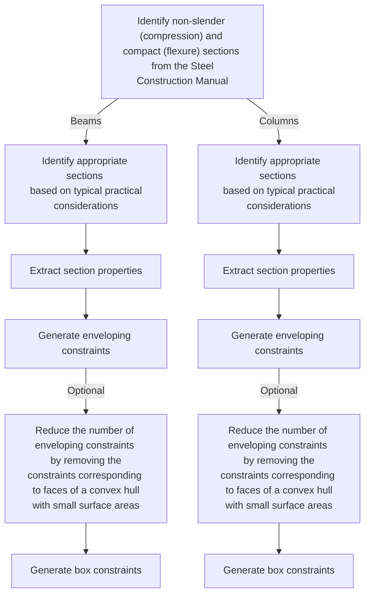
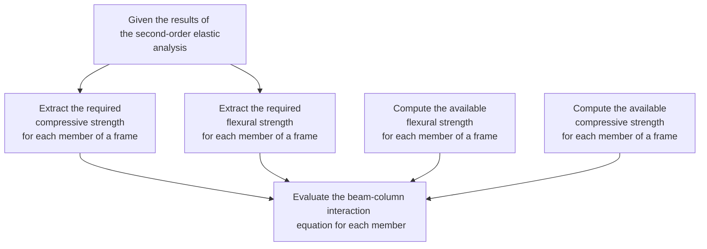

# StructuralDesignOptimization.jl

This repository aims to reconstruct the two-step structural design optimization scheme developed in this [journal article](https://ascelibrary.org/doi/epdf/10.1061/%28ASCE%290733-9445%281988%29114%3A5%281120%29) using more modern tools. Most notably, the following tools are used:

- Polyhedra.jl: Generating enveloping constraints.
- Optimization.jl: Performing continuous optimization.

## Roadmap

- [x] Identify sets of appropriate sections for beam and column members from the Steel Construction Manual that are both non-slender in compression and compact in flexure based on the typical practical considerations.
  - Identify the set of sections that are both non-slender in compression and compact in flexure.
  - Reduce the set into two sets for beam and column members, respectively, based on the typical practical considerations.
- [x] Generate enveloping constraints using the section properties ($A_{g}$, $I_{x}$, $Z_{x}$) of these sets of appropriate sections.
  - If the number of the enveloping constraints was reduced in any way, generate box constraints as well.
- [x] Generate stress constraints based on the beam-column interaction equations.
  - Compute the available strengths for each member in a frame ($\varphi_{c} P_{n}$, $\varphi_{b} M_{n}$).
  - Evaluate the FE model of the frame and extract the required strengths for each member ($P_{r}$, $M_{r}$).
  - Evaluate the beam-column interaction equation for each member.
- [ ] Compile most of this functionality into a reusable package.

## Typical Practical Considerations

- Since most the structural analysis software cannot account for the local buckling limit states, the choice of appropriate sections is limited to ones that are non-slender in compression and compact in flexure.
- Choice of appropriate sections for beams is unrestricted.
- Choice of appropriate sections for columns is restricted to W8X... - W14X... sections.
- Beams on the same floor must have the same sections.
- Outer columns on the same floor must have the same sections.
- Inner columns on the same floor must have the same sections.

## Generating Geometric Constraints

## Stress Constraints

