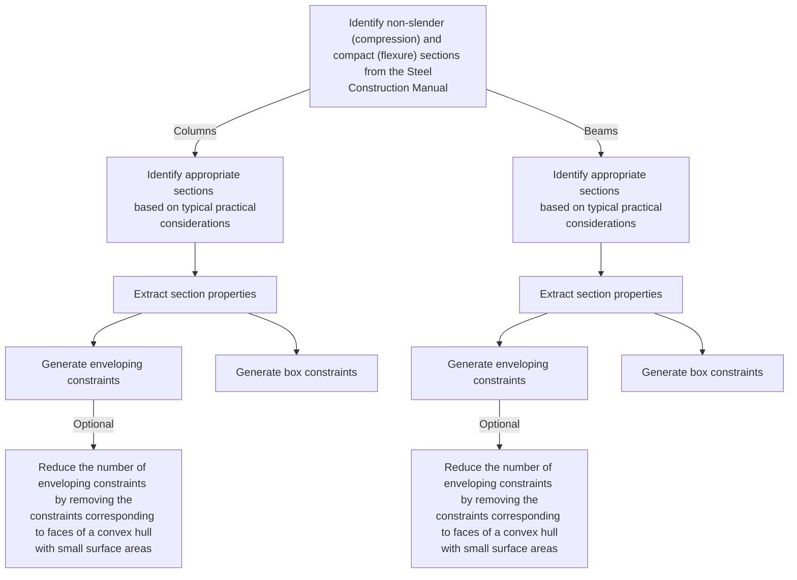
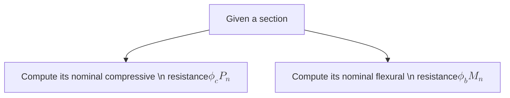

# StructuralDesignOptimization.jl

## Typical Practical Considerations

- Since most the structural analysis software cannot account for the local buckling limit states, the choice of appropriate sections is limited to ones that are non-slender in compression and compact in flexure.
- Choice of appropriate sections for beams is unrestricted.
- Choice of appropriate sections for columns is restricted to W8X... - W14X... sections.
- Beams on the same floor must have the same sections.
- Outer columns on the same floor must have the same sections.
- Inner columns on the same floor must have the same sections.

## Generating Geometric Constraints

## Generating Stress Constraints

